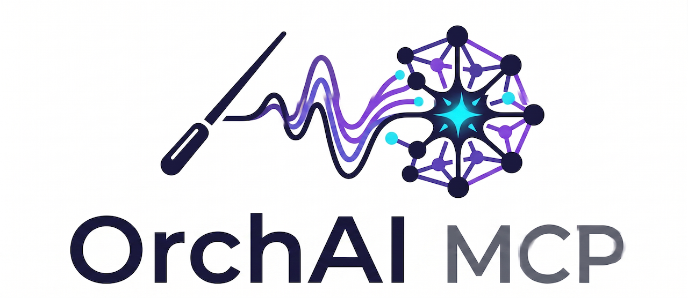

<p align="center">
  
</p>

# orcai-mcp

**A self-hostable MCP server that lets Claude Code and Cursor manage a fleet of sub-agents per project.**

[](https://opensource.org/licenses/MIT)
[](https://www.python.org/downloads/)
[](https://modelcontextprotocol.io)

---

## What it does

orcai-mcp exposes an MCP server that your IDE agent (Claude Code, Cursor, or any MCP-compatible client) can connect to. Once connected, the agent can register sub-agents with different roles and system prompts, delegate tasks to them, queue work, and collect results — all through standard MCP tool calls.

Each project gets one Docker container running a single Python process. That process serves the MCP protocol on `/mcp` and a management REST API + React UI on the same port.

```
IDE (Claude Code / Cursor)
    │  MCP tool calls (Streamable HTTP)
    ▼
orcai-mcp container  :8100
    ├── /mcp        ← MCP protocol (FastMCP)
    ├── /api/v1/*   ← REST API for the web UI
    ├── /ui         ← React dashboard
    └── /health     ← Health check
          │
          │  spawns agents via
          ▼
Anthropic API  /  Claude Code CLI subprocess
```

---

## Features

- **8 MCP tools** — add, update, list, and prompt agents; delegate tasks with priority and retry; install skills
- **Task queue** — configurable concurrency limit and queue depth; priority ordering (1–5); exponential-backoff retries
- **Two execution modes** — call the Anthropic API directly (`runner: api`) or spawn the Claude Code CLI as a subprocess (`runner: cli`)
- **Shared project workspace** — CLI agents automatically receive `$PROJECT_DIR` in their environment and a `project/` symlink in their working directory pointing at the project root, enabling all agents to read and write shared files
- **React UI** — dashboard, agent editor with system-prompt editing, task history, skills library
- **CLI** — `orcai-mcp init / up / down / register / add / delegate / status / logs`
- **IDE auto-registration** — writes `.mcp.json` (Claude Code) or `.cursor/mcp.json` (Cursor) for you
- **Graceful shutdown** — in-flight tasks drain before the process exits
- **Structured JSON logging** — all task lifecycle events emitted as JSON

---

## Requirements

- Docker and Docker Compose **or** Python 3.12+
- An [Anthropic API key](https://console.anthropic.com/) (for `runner: api` mode) **or** Claude Code CLI authenticated (for `runner: cli` mode — no API key needed)
- Podman + podman-compose work as a drop-in replacement for Docker — see [notes below](#podman)

---

## Quick start (local, no Docker)

The simplest path, especially on macOS. No API key required if you use `runner: cli` mode with an existing Claude Code login.

**1. Clone and enter the repo**

```bash
git clone https://github.com/quieromas-ai/orcai-mcp.git
cd orcai-mcp
```

**2. Create a virtual environment and install**

> **macOS note:** macOS 3.12+ ships as an externally-managed Python. Always use a virtual environment — running `pip install` without one will be rejected.

```bash
python3 -m venv .venv
source .venv/bin/activate
pip install -e .
```

**3. Configure**

```bash
cp .env.example .env
```

Open `.env`. The defaults work out of the box for local use. Key settings:

```bash
# Leave blank if using runner: cli mode with Claude Code login
ANTHROPIC_API_KEY=

# Keep paths local to the project folder (not Docker volume paths)
DATA_DIR=./data
WORKSPACE_DIR=./workspace
SKILLS_DIR=./skills
PROJECT_DIR=.

# Auth disabled for local dev — fine as-is
MCP_AUTH_DISABLED=true
```

**4. Initialise project structure and start**

Open two terminals. In the first:

```bash
source .venv/bin/activate
orcai-mcp init --ide claude
orcai-mcp up --local
```

You should see:

```
{"message": "Starting orcai-mcp server"}
{"message": "Database and task engine initialised"}
INFO: Uvicorn running on http://0.0.0.0:8100
```

Verify it's healthy in the second terminal:

```bash
curl http://localhost:8100/health
# {"status":"ok","agents":0,"queue_depth":0}
```

**5. Register with Claude Code**

```bash
source .venv/bin/activate
orcai-mcp register
```

This writes `.mcp.json` to your project root. Then explicitly add the server to Claude Code:

```bash
claude mcp add --transport http orcai-mcp http://localhost:8100/mcp
claude mcp list
# orcai-mcp: http://localhost:8100/mcp (HTTP) - ✓ Connected
```

> **Note:** `orcai-mcp register` writes `.mcp.json` but Claude Code may not pick it up automatically. Running `claude mcp add` explicitly is the reliable path.

> **Note:** Use the URL without a trailing slash (`/mcp`, not `/mcp/`). Claude Code does not follow the redirect.

---

## Quick start (Docker)

**1. Clone and configure**

```bash
git clone https://github.com/quieromas-ai/orcai-mcp.git
cd orcai-mcp
cp .env.example .env
# edit .env and set ANTHROPIC_API_KEY
```

**2. Start**

```bash
docker compose up -d
```

**3. Register with your IDE**

```bash
pip install orcai-mcp   # install CLI only — not the server
orcai-mcp init --ide claude
claude mcp add --transport http orcai-mcp http://localhost:8100/mcp
claude mcp list
# orcai-mcp: http://localhost:8100/mcp (HTTP) - ✓ Connected
```

Open the dashboard at **http://localhost:8100/ui**.

### Podman

Podman works as a drop-in replacement. Substitute `podman compose` wherever the docs say `docker compose`:

```bash
podman compose up -d
podman compose down
```

The `>>>>` message that appears before podman-compose output is informational noise from Podman's external compose provider — not an error.

---

## Running without an API key (Claude Code native auth)

If you have Claude Code installed and authenticated via your Anthropic account, you can run agents without an API key at all. Set `runner: cli` when creating agents:

```bash
# .env — leave ANTHROPIC_API_KEY blank
ANTHROPIC_API_KEY=
```

When delegating tasks, agents are spawned as Claude Code CLI subprocesses and inherit your existing OAuth session. No charges to an API key, no separate credential to manage.

> **Requirement:** The `claude` CLI must be installed and `claude --version` must return a version number.
> - **Local (no Docker):** install the CLI on the host via `curl -fsSL https://claude.ai/install.sh | bash`.
> - **Docker:** the official image ships with the Claude Code CLI pre-installed. If you build a custom image, ensure the `claude` binary is available on `PATH` inside the container — without it, tasks will fail with `[Errno 2] No such file or directory` at runtime.

### Docker — passing OAuth credentials to the container

The container runs as a non-root user and has no Claude session of its own. Mount your host session so the CLI inside the container can authenticate:

```yaml
# docker-compose.yml
volumes:
  - ~/.claude:/home/orcai/.claude        # OAuth session, history, config dir
  - ~/.claude.json:/home/orcai/.claude.json  # active credentials file
```

Both paths must exist on the host (they are created automatically when you authenticate with `claude` on the host). Because the host user and the container's `orcai` user share uid 1000, no permission issues arise.

> **Note:** `~/.claude.json` sits one level above `~/.claude/` and is **not** included in the directory mount — both entries are required.

### Docker — enabling git push (SSH keys & git config)

Agents running in Docker need the host's SSH keys and git config to push to remote repositories. The default `docker-compose.yml` already includes these mounts:

```yaml
# docker-compose.yml
volumes:
  - ~/.ssh:/home/orcai/.ssh:ro              # SSH keys + known_hosts (read-only)
  - ~/.gitconfig:/home/orcai/.gitconfig:ro  # git user.name, user.email, etc.
```

Both are mounted read-only (`:ro`) — the container can authenticate but cannot modify your host credentials. The host user and the container's `orcai` user share uid 1000, so permissions work without adjustment.

> **Prerequisites:** `~/.ssh/` must contain your SSH key (e.g. `id_ed25519`) and `known_hosts` with entries for your git hosts (GitHub, GitLab, etc.). If `known_hosts` is missing, run `ssh-keyscan github.com >> ~/.ssh/known_hosts` on the host before starting the container.

---

## Connecting to Claude desktop app (Cowork / Claude.ai)

The Claude desktop app requires HTTPS for HTTP-type MCP servers. For local use, `mkcert` creates a locally-trusted certificate with no public exposure:

```bash
brew install mkcert
mkcert -install      # adds a local CA to macOS keychain (one-time)
mkcert localhost     # generates localhost.pem + localhost-key.pem
```

Start the server with TLS instead of `orcai-mcp up --local`:

```bash
source .venv/bin/activate
uvicorn src.main:app --host 0.0.0.0 --port 8100 \
  --ssl-certfile localhost.pem \
  --ssl-keyfile localhost-key.pem
```

Then in `~/Library/Application Support/Claude/claude_desktop_config.json`:

```json
{
  "mcpServers": {
    "orcai-mcp": {
      "type": "http",
      "url": "https://localhost:8100/mcp"
    }
  }
}
```

Restart the Claude desktop app. The connection is fully local — no tunnel, no public URL.

---

## Usage

### From Claude Code / Cursor

Once connected, your IDE agent can use the tools naturally. Example conversation:

```
You: Create a backend agent and have it write a health check endpoint

Claude Code:
  → add_agent(name="Backend Dev", role="backend",
               system_prompt="You write Python FastAPI code...")
  → delegate_task(agent_id="...", description="Write a /health endpoint
                   that returns {status: ok, version: ...}")
  → check_task_status(task_id="...")
  → [reads output from .claude/agents/outputs/{task_id}/result.json]
```

### CLI

```bash
# List registered agents
orcai-mcp list

# Add an agent from a system prompt file
orcai-mcp add "Frontend Dev" --role frontend --prompt ./agents/frontend.md

# Delegate a task
orcai-mcp delegate <agent-id> "Build a login form component" --priority 4

# Check task status
orcai-mcp status <task-id>

# Show recent logs for an agent
orcai-mcp logs <agent-id>
```

### MCP tools reference

| Tool | Description |
|---|---|
| `add_agent` | Register a new sub-agent with name, role, system prompt, and model |
| `update_agent` | Update any field on an existing agent |
| `get_agents` | List agents, optionally filtered by role or status |
| `get_active_agents` | List agents currently executing a task |
| `delegate_task` | Assign a task to an agent; queued if agent is busy |
| `check_task_status` | Poll the status and output of a delegated task |
| `install_skill` | Install a Markdown skill file and optionally assign to agents |
| `prompt_agent` | Send an ad-hoc message to an agent and wait for a response |

Full parameter documentation is available via MCP resource discovery or at `/api/v1/docs`.

---

## Configuration

All configuration is via environment variables. Copy `.env.example` to `.env` to get started.

| Variable | Default | Description |
|---|---|---|
| `PORT` | `8100` | Port the server listens on |
| `MCP_AUTH_TOKEN` | _(empty)_ | Bearer token required on all requests |
| `MCP_AUTH_DISABLED` | `true` | Set to `false` to enforce auth |
| `IDE_TARGET` | `claude` | `claude` or `cursor` — controls artifact output paths |
| `MAX_CONCURRENT_AGENTS` | `3` | Max simultaneous agent tasks |
| `TASK_QUEUE_SIZE` | `20` | Max queued tasks before rejecting |
| `ANTHROPIC_API_KEY` | _(required for api runner)_ | Anthropic API key |
| `DATA_DIR` | `/data` | SQLite database location |
| `WORKSPACE_DIR` | `/workspace` | Agent working directories |
| `SKILLS_DIR` | `/skills` | Installed skill Markdown files |
| `PROJECT_DIR` | `.` | Project root — artifacts are written here; also exposed to CLI agents as `$PROJECT_DIR` and a `project/` symlink in each agent's workspace |
|| `MCP_ALLOWED_HOSTS` | _(empty)_ | Comma-separated allowed `Host` header values for DNS rebinding protection. Required when behind a reverse proxy — set to your public domain (e.g. `mcp.yourserver.com`). Empty disables the check. |
| `ENABLE_AGENT_DELEGATION` | `true` | When enabled, CLI-runner agents can delegate tasks to sibling agents via a restricted MCP endpoint. |

---

## Deploying behind a reverse proxy (nginx + TLS)

When orcai-mcp runs behind nginx, two things must be configured correctly.

**1. Set `MCP_ALLOWED_HOSTS` to your public domain**

The MCP SDK validates the `Host` header on every request to prevent DNS rebinding attacks. By default the allowed list is empty, which disables the check. When your domain is public you should enable it:

```bash
# .env
MCP_ALLOWED_HOSTS=mcp.yourserver.com
```

If this is not set and the server is behind a proxy forwarding `Host: your-domain.com`, every MCP request will be rejected with HTTP 421.

**2. nginx must forward the original `Host` header**

```nginx
proxy_set_header Host $host;
```

Do **not** rewrite it to `localhost` — the SDK validates the header after nginx passes it through.

**3. Allow Anthropic's outbound IPs on the `/mcp` location**

Claude Code and Claude.ai make MCP tool calls from Anthropic's infrastructure, not the user's machine. Add their outbound CIDR alongside your own IP:

```nginx
location /mcp {
    allow <your-ip>;
    allow 160.79.104.0/21;   # Anthropic outbound — https://platform.claude.com/docs/en/api/ip-addresses
    deny all;
    ...
}
```

A complete example nginx config is in `examples/nginx/remote.conf`.

---

## Agent execution modes

orcai-mcp supports two ways to run agents. Set `runner` in the agent's `config` when calling `add_agent`.

**`api` (default)** — calls the Anthropic Messages API directly via httpx. Works anywhere, no local tooling required. Requires `ANTHROPIC_API_KEY`.

```python
add_agent(name="API Agent", role="...", config={"runner": "api"})
```

**`cli`** — spawns Claude Code as a subprocess. Gives the agent full access to the filesystem, terminal, and any tools Claude Code supports. Requires the `claude` CLI to be installed and authenticated in the execution environment. Agents run with `--dangerously-skip-permissions` so they do not block on interactive prompts — only use this mode in trusted, sandboxed environments.

```python
add_agent(name="CLI Agent", role="...", config={"runner": "cli"})
```

### Agent-to-agent delegation

CLI-runner agents can delegate tasks to sibling agents. When `ENABLE_AGENT_DELEGATION=true` (the default), each CLI subprocess is launched with the orcai-mcp delegate endpoint registered as an MCP server. The agent can then discover siblings and assign them work without any manual configuration.

```
IDE (Claude Code / Cursor)
    │  MCP /mcp (all 8 tools)
    ▼
orcai-mcp container  :8100
    │  spawns CLI subprocesses
    ▼
Agent A ──── MCP /mcp/delegate (4 tools) ──── orcai-mcp
Agent B ──── MCP /mcp/delegate (4 tools) ──── orcai-mcp
    │
    └─── Agent A calls delegate_task → Agent B picks up the work
```

Sub-agents get a restricted tool set to prevent runaway agent creation or deadlocks:

| Tool | Available | Reason |
|---|---|---|
| `get_agents` | Yes | Discover sibling agents |
| `delegate_task` | Yes | Assign work to a sibling |
| `check_task_status` | Yes | Poll for completion |
| `get_agent_logs` | Yes | Read a sibling's output |
| `add_agent` | No | Only the parent IDE creates agents |
| `update_agent` | No | Only the parent IDE mutates agents |
| `install_skill` | No | Only the parent IDE manages skills |
| `prompt_agent` | No | Blocks with polling — could deadlock |

A delegation hint is automatically appended to each CLI agent's system prompt so the agent knows it can delegate. To disable agent-to-agent delegation entirely:

```bash
# .env
ENABLE_AGENT_DELEGATION=false
```

### Shared workspace

Every CLI-runner agent gets two ways to reach the shared project directory (`PROJECT_DIR`):

| Mechanism | Value | Notes |
|---|---|---|
| `$PROJECT_DIR` env var | path to `PROJECT_DIR` | available to any shell command or tool |
| `project/` symlink in cwd | → `PROJECT_DIR` | visible from `ls` in the agent's own workspace |

Each agent still has its own private workspace at `/workspace/{agent-id}/` — helper files (`.system_prompt.md`, `.mcp-delegate.json`) and agent-specific artefacts live there. The `project/` symlink is an additional entry point, not a replacement.

**Docker:** `PROJECT_DIR` must be bind-mounted into the container for the symlink to resolve. The default `docker-compose.yml` already does this:

```yaml
volumes:
  - ${PROJECT_DIR:-.}:/project
```

Set `PROJECT_DIR` in your `.env` to the host path of your project:

```bash
# .env
PROJECT_DIR=/path/to/your/project
```

**Local (no Docker):** `PROJECT_DIR` can be a relative path (e.g. `.`) — the symlink will point there. Because the server and agents run in the same OS process, the path resolves without any mount.

**Multi-agent collaboration:** when multiple agents share the same `PROJECT_DIR`, they can write to a common directory and read each other's output without needing to know sibling workspace UUIDs. Reference the shared path in system prompts to establish a naming convention, for example:

```
Write deliverables to: $PROJECT_DIR/cowork-resources/<your-name>/
Read other agents' output from: $PROJECT_DIR/cowork-resources/
```

---

## Artifact output

Task outputs are written to the project directory under the IDE target path:

```
# Claude Code
.claude/agents/outputs/{task_id}/result.json

# Cursor
.cursor/agents/outputs/{task_id}/result.json
```

Override the base directory with the `PROJECT_DIR` environment variable.

---

## Example agent system prompts

The `examples/agents/` directory contains ready-to-use system prompts:

- `frontend-dev.md` — React/TypeScript component development
- `backend-dev.md` — Python FastAPI endpoint development

Use them with:

```bash
orcai-mcp add "Frontend Dev" --role frontend --prompt examples/agents/frontend-dev.md
orcai-mcp add "Backend Dev"  --role backend  --prompt examples/agents/backend-dev.md
```

---

## Remote deployment (nginx + TLS)

For a server accessible over the network, put nginx in front of the container. Example config is in `examples/nginx/remote.conf`. Key settings required:

```nginx
proxy_read_timeout 300s;   # long-running agent tasks
proxy_buffering off;        # SSE / streaming support
```

Set `MCP_AUTH_TOKEN` and `MCP_AUTH_DISABLED=false` when running remotely. Then register with your IDE using the public URL:

```bash
orcai-mcp register --url https://mcp.yourserver.com --token <your-token>
```

---

## Troubleshooting

**`orcai-mcp` not showing in `claude mcp list` after `register`**

`orcai-mcp register` writes `.mcp.json` but Claude Code may not pick it up automatically from the file. Add it explicitly:

```bash
claude mcp add --transport http orcai-mcp http://localhost:8100/mcp
```

**`✗ Failed to connect` in `claude mcp list`**

Check two things: the server is running (`curl http://localhost:8100/health` returns `ok`), and the registered URL has no trailing slash — `http://localhost:8100/mcp` not `http://localhost:8100/mcp/`.

**`error: externally-managed-environment` when running `pip install`**

You're using a system-managed Python (common on macOS with Homebrew). Use a virtual environment:

```bash
python3 -m venv .venv && source .venv/bin/activate
pip install -e .
```

**Claude desktop app rejects `http://localhost` with an HTTPS error**

The Claude desktop app enforces HTTPS for MCP servers. Use `mkcert` to create a locally-trusted certificate — see [Connecting to Claude desktop app](#connecting-to-claude-desktop-app-cowork--claudeai) above.

**`DATA_DIR=/data: No such file or directory` on local install**

The default `DATA_DIR` is `/data`, which is a Docker volume path. For local installs, override it in `.env`:

```bash
DATA_DIR=./data
WORKSPACE_DIR=./workspace
SKILLS_DIR=./skills
PROJECT_DIR=.
```

---

## Development

```bash
git clone https://github.com/quieromas-ai/orcai-mcp.git
cd orcai-mcp

python3 -m venv .venv && source .venv/bin/activate
pip install -e ".[dev]"

# Run quality checks
uv run ruff check src/ cli/
uv run mypy src/ cli/
uv run pytest

# Start locally
cp .env.example .env
orcai-mcp up --local
```

The test suite covers MCP tools, task engine concurrency, graceful shutdown, retry logic, REST API, skill manager, and CLI. Tests use an in-memory SQLite database and mock the agent runner by default. The end-to-end CLI test (`test_cli_runner_end_to_end_with_system_prompt`) is automatically skipped if `claude` is not installed.

### Dev container

`orcai-mcp init` can scaffold a `.devcontainer/` directory so you can develop inside a fully configured container in VS Code or Cursor without setting up Python or Node locally:

```bash
orcai-mcp init --ide claude --devcontainer
```

This generates `.devcontainer/devcontainer.json` with:

- Python 3.12 slim image + Node 20 (for the React UI)
- Port 8100 forwarded to the host
- `pip install -e '.[dev]'` run automatically on container start
- Local-dev environment variables pre-set (`DATA_DIR=./data`, `MCP_AUTH_DISABLED=true`, etc.)
- VS Code / Cursor extensions: Python, Pylance, Ruff, mypy

Open the cloned folder in VS Code or Cursor and choose **Reopen in Container** (or **Dev Containers: Open Folder in Container** from the command palette). The container starts, installs dependencies, and you're ready to run `orcai-mcp up --local`.

---

## Contributing

Contributions are welcome. Please:

1. Open an issue before starting significant work so we can discuss the approach.
2. Follow the existing code style — `ruff` and `mypy` must pass with no new errors.
3. Add or update tests for any changed behaviour.
4. Keep PRs focused — one concern per PR.

Bug reports and feature requests via [GitHub Issues](https://github.com/quieromas-ai/orcai-mcp/issues).

---

## Roadmap

- [ ] `--ssl-certfile` / `--ssl-keyfile` flags on `orcai-mcp up --local`
- [x] Dev container scaffolding (`orcai-mcp init --devcontainer` generates `.devcontainer/`)
- [x] Agent-to-agent delegation
- [x] Shared project workspace (`$PROJECT_DIR` + `project/` symlink for CLI agents)
- [ ] Multi-model support (OpenAI, Ollama)
- [ ] Webhook / Slack completion events
- [ ] MCP Registry listing
- [ ] Prometheus metrics endpoint

---

## License

MIT — see [LICENSE](LICENSE).
